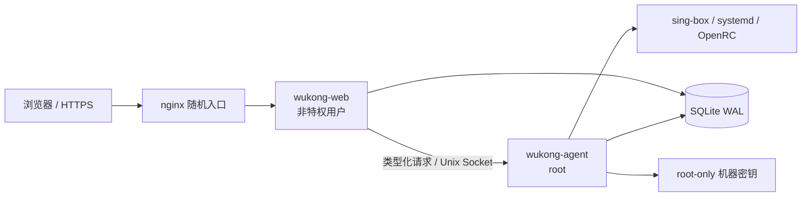

# 悟空面板

悟空面板是面向个人与小型团队的单机 VPS 节点控制台，将 Hysteria2 部署、生命周期管理、分享订阅、主机状态和整机流量账期放在同一个安全界面中。


## 特性

- 单机自治：每台 VPS 独立安装，无需中心服务器。
- Hysteria2：IPv6 优先、纯 IPv4、纯 IPv6、NAT 本地绑定、设备专用节点。
- 安全管理：非特权 Web 服务与 root Agent 通过受限 Unix Socket 通信。
- 无损接管：扫描 `/etc/s-box` 与 systemd/OpenRC 服务，确认后导入，不重写未知字段。
- 安全变更：配置暂存、`sing-box check`、原子替换、SHA-256 快照与失败回滚。
- 实时观测：10 秒采样流量、CPU、内存、磁盘、负载、节点状态与进程 CPU/RSS；容量指标显示已用/总量。
- 流量时间轴：今日按小时、本账期按日展示下载/上传堆叠流量，支持提示卡与平均线。
- 多设备显示：流量脉络按节点展示 HY2 采集器最近完成窗口的客户端下行速率，并在窄屏自动折叠为 `+N`。
- 分享订阅：短时显示节点密钥，提供二维码及带流量响应头的 Clash/Mihomo 订阅。
- 东方科幻界面：桌面、平板和移动端响应式布局。

## 一键安装

支持 Debian、Ubuntu、Rocky Linux、AlmaLinux、Alpine；支持 `amd64`、`arm64`。

```bash
curl -fsSL https://github.com/252201/wukong-panel/releases/latest/download/install.sh | sudo sh
```

同一个入口同时负责安装、更新和卸载：未安装时进入安装向导；检测到已有面板时默认提供安全更新，并可选择重新配置、保留数据卸载或彻底卸载。更新模式只替换校验后的二进制，不重新申请证书、不改 nginx 和节点配置；更新前会停服务复制 SQLite 一致性备份，健康检查失败则自动回滚。

首次安装可依次填写面板域名、HTTPS 端口、证书方式和 ACME 邮箱。填写域名后默认申请 Let’s Encrypt 证书，并可选择 HTTP-01 自动验证、仅 IPv4、仅 IPv6 或 Cloudflare DNS-01。纯脚本/CI 环境会自动保持非交互；也可显式使用 `--unattended`。

申请证书前应先把域名的 A/AAAA 记录指向该 VPS。HTTP-01 要求公网 TCP 80 可达；IPv4 NAT 端口受限但 IPv6 不限端口时，选择“仅 IPv6”，并确保域名 AAAA 记录正确。

NAT VPS、只开放指定端口的 VPS，需要在安装时把面板 HTTPS 端口设为可用的 **TCP** 端口。通过管道执行时，参数必须写在 `sh -s --` 后面：

```bash
curl -fsSL https://github.com/252201/wukong-panel/releases/latest/download/install.sh \
  | sudo sh -s -- --port 你的可用TCP端口
```

如果提供商的公网端口与 VPS 内部端口不同，安装器的 `--port` 填内部监听端口，浏览器使用提供商分配的公网映射端口。IPv6 没有限制时，安装完成信息也会单独打印带方括号的 IPv6 访问地址。

常用安装参数：

```bash
# 直接更新到 latest（不修改现有配置、证书和节点）
curl -fsSL https://github.com/252201/wukong-panel/releases/latest/download/install.sh \
  | sudo sh -s -- --update

# 更新到悟空验证过的 sing-box 稳定版本；旧二进制和配置快照会保留
curl -fsSL https://github.com/252201/wukong-panel/releases/latest/download/install.sh \
  | sudo sh -s -- --update-sing-box

# 回退到上一次保留的 sing-box 版本
curl -fsSL https://github.com/252201/wukong-panel/releases/latest/download/install.sh \
  | sudo sh -s -- --rollback-sing-box

# 卸载面板并保留配置、数据库和 sing-box 节点
curl -fsSL https://github.com/252201/wukong-panel/releases/latest/download/install.sh \
  | sudo sh -s -- --uninstall

# 完全删除悟空面板配置和数据；仍不删除 sing-box 节点
curl -fsSL https://github.com/252201/wukong-panel/releases/latest/download/install.sh \
  | sudo sh -s -- --uninstall --purge

# 固定版本、自定义端口和入口
sudo sh install.sh --version v0.3.4 --port 9443 --base-path /my-secret-panel/

# 使用现有证书
sudo sh install.sh --domain panel.example.com \
  --cert-file /path/fullchain.cer --key-file /path/private.key

# HTTP-01（要求公网 80 未被占用）
sudo sh install.sh --domain panel.example.com --acme http --email admin@example.com

# IPv6 HTTP-01（适用于 IPv4 NAT 端口受限、IPv6 公网 80 可达）
sudo sh install.sh --domain panel.example.com --acme http \
  --acme-ip-version 6 --email admin@example.com

# Cloudflare DNS-01
sudo -E env CF_Token=... CF_Zone_ID=... sh install.sh \
  --domain panel.example.com --acme cloudflare
```

无域名时默认监听 HTTPS `9443` 并生成自签名证书。安装器不会修改 SSH、防火墙或云安全组，只会提示需要开放的端口。

### sing-box 安全更新与回退

悟空面板只允许安装内置清单中经过验证的 sing-box 版本，当前兼容稳定版锁定为 `1.11.15`。1.12 在 `qw` 的 VPNGate `bind_interface` 实际流量回归中出现运行时异常，1.13 又删除了现有 1.10 配置仍在使用的旧 inbound 字段，因此在完成配置迁移和运行时适配前不会开放这两个版本。更新流程会：

1. 下载官方 GitHub Release 并核对固定 SHA-256。
2. 使用新二进制逐一检查 `/etc/s-box/*.json`，任何配置不兼容都会在替换前停止。
3. 保存旧二进制、版本号、活动服务清单和全部 JSON 配置快照。
4. 仅停止当前正在运行且确实使用目标二进制的 sing-box 服务。
5. 替换后二次检查配置并恢复原活动服务；启动失败自动恢复旧二进制。

备份保存在 `/var/lib/wukong-panel/backups/sing-box/`。手动回退前也会先用旧二进制检查当前配置；若升级后创建的新配置无法被旧版解析，回退会被拒绝，避免盲目降级导致全部节点离线。

## 架构与安全边界



- 管理账号默认为 `admin`；初始密码只在首次安装时打印，首次登录强制改密。
- 密码使用 Argon2id，节点密钥使用 AES-256-GCM，机器密钥权限为 `0600`。
- 会话 Cookie 使用 `Secure`、`HttpOnly`、`SameSite=Strict`，所有变更 API 校验 CSRF。
- 登录按来源 IP 限速；所有节点变更、密钥显示与设置修改写入审计日志。
- Agent 不接收任意命令字符串，只执行固定类型操作。

## CLI

安装后 `wukongctl` 与 `wukong-panel` 指向同一二进制：

```bash
wukongctl doctor
wukongctl scan
wukongctl node create --name "AC-HY2" --domain node.example.com \
  --mode prefer_v6 --ipv4-bind 192.0.2.10 --ipv6 2001:db8::10
wukongctl node action --id NODE_ID --action restart
```

`compat/deploy-hy2.sh` 保留原参数模式入口，并将参数交给 `wukongctl node create`。交互部署改由面板完成。

## API

管理 API 固定在 `/api/v1`：

- `auth/login|me|password|logout`
- `overview`、`metrics`、`metrics/endpoints`、`metrics/timeline`
- `nodes`、`nodes/{id}/actions`、`nodes/{id}/share`
- `imports/scan|confirm`
- `jobs`、`jobs/{id}/events`
- `settings`、`settings/subscription-token`

变更接口返回任务 ID；任务通过轮询或 SSE 获取进度。订阅接口位于 `/sub/{token}/clash.yaml`，订阅令牌与管理入口相互独立。

## 本地开发

```bash
cd web
npm install
npm run build
cd ..

go test ./...
go build -o build/wukong-panel ./cmd/wukong-panel

rm -rf /tmp/wukong-demo
./build/wukong-panel serve \
  --listen 127.0.0.1:8788 \
  --data-dir /tmp/wukong-demo \
  --config-dir /tmp/wukong-sbox \
  --base-path / --secure-cookie=false --demo
```

## 从现有服务器迁移

1. 安装面板但不要修改 sing-box 版本。
2. 在“接管节点”中查看扫描结果和共享服务关系。
3. 确认导入；导入过程不会重写现有 JSON。
4. 并行运行旧监控和悟空指标至少 24 小时。
5. 确认订阅、账期和流量一致后再停用旧 timer/service。

sing-box 1.10 配置以兼容模式接管；新配置根据检测到的 sing-box 版本生成。跨版本升级前请阅读[官方迁移文档](https://sing-box.sagernet.org/migration/)。

## 卸载

```bash
sudo sh install.sh --uninstall          # 保留面板数据、节点和 sing-box
sudo sh install.sh --uninstall --purge  # 额外删除悟空面板自身数据
```

独立的 `uninstall.sh` 仍保留兼容。两种卸载入口都不会删除 `/etc/s-box` 或任何节点服务。

## License

MIT
